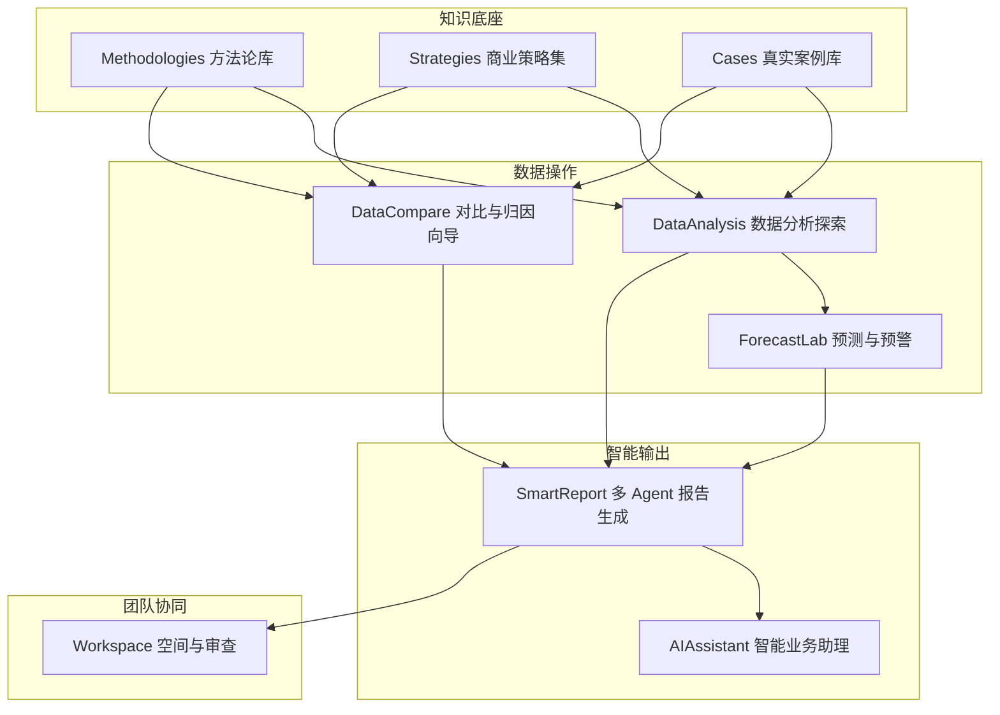
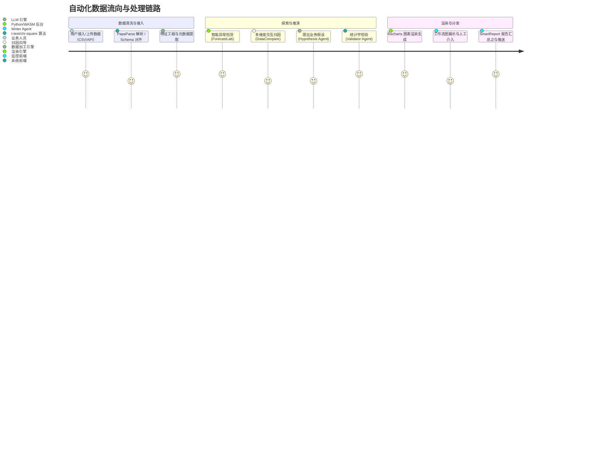

# 智能电商数据分析工作台 (E-Commerce Data Analyst Workspace) 产品设计与规划文档

## 1. 概述
本系统是一个面向电商数据分析师的下一代智能数据工作台。平台不仅涵盖了真实电商分析案例、业务策略、模型复盘，更通过大语言模型（LLM）驱动深度数据探索。旨在提供从“数据接入 → 诊断分析 → 策略输出 → 团队协作”的端到端闭环闭环体验，帮助电商从业者以十倍效率洞察业务真相。

---

## 2. 差异化定位（Why Us）

面对市场上繁多的数据工具，我们的工作台在以下维度建立了“垂直 + 方法论”的双重护城河：

| 对比维度 | 传统 BI（如 Tableau/PowerBI） | 通用 AI（如 ChatGPT/Claude） | 本工作台（下一代电商 AI BI） |
| :--- | :--- | :--- | :--- |
| **数据接入门槛** | 需懂 SQL 或 ETL 建模，门槛极高 | 上传文件即可，但无结构化沉淀 | **零门槛接入，多源一键同步，内置电商 Schema 抽象层** |
| **业务上下文理解** | 需要分析师自己构建业务逻辑 | 无垂直行业 know-how，易泛泛而谈 | **内置数百种真实电商案例及行业基准，AI "懂行"** |
| **思维链可解释性** | 仅图表展示，无归因推演 | 思维跳跃或存在幻觉，难以验证 | **每步分析保留可控思维链，支持交叉验证与幻觉过滤** |
| **行业方法论沉淀** | 工具属性，不包含分析思路 | 临时提问，方法论不系统不可复用 | **内置 DID、PSM、复购模型等专业方法论一键执行** |
| **协作与知识复用** | 以仪表盘为中心，难以探讨过程 | 个人对话窗口，知识无法团队流转 | **支持分析师工作流与团队 Workspace，沉淀业务图谱** |

---

## 3. 核心指标与衡量体系（产品成功度量）

为确保平台持续创造价值，我们建立以下北极星指标与监控体系：

### 3.1 用户价值指标
*   **报告生成完成率**：用户开始创建 SmartReport 到最终导出的比例（目标值：> 75%）。
*   **洞察采纳率**：业务方对 AI 输出的结论打标“已采纳”的比例，反映 AI 洞察真实命中业务痛点的概率（目标值：> 40%）。

### 3.2 平台健康指标
*   **AI 思维链平均步数**：衡量系统复杂分析的深度，过短可能流于表面，过长易产生幻觉（目标健康范围：5 - 12 步）。
*   **低置信度报告占比**：触发幻觉防护层或存在数值校验失败的报告比例（目标值：< 5%）。

### 3.3 商业增长指标
*   **周活分析师数（WAU）**：每周至少执行一次深度归因或生成一份报告的用户数。
*   **案例库/工作流贡献人数**：向平台模板市场或用例库（Cases）贡献自定义沉淀的人数占比（目标：> 10% 用户参与共建）。

---

## 4. 产品架构图与数据流向图

### 4.1 系统模块架构图
运用七大核心模块，实现业务洞察流转。

### 4.2 用户数据流向图
展示从数据接入到价值输出的完整技术链路。

---

## 5. 核心功能模块与特性

### 5.1 【新增】归因分析向导 (Attribution Wizard) - DataCompare 模块
当监测到指标异动时，系统提供引导式提问（核心指标？异动方向？时间窗口？）。
系统将自动执行维度下钻（渠道 × 品类 × 人群 × 时段）和贡献度分解（加法/乘法模型），同时包含辛普森悖论检测，最终输出 **“归因瀑布图 + Top3 主因 + 可执行动作”**。

### 5.2 【新增】预测与预警引擎 (ForecastLab)
*   **时序预测**：输入历史 GMV/DAU，可自动调用 ARIMA / Prophet / LSTM 算法输出未来趋势预测。
*   **异常检测**：通过 3-sigma / IQR 实现在数据流上的打点预警。
*   **自动报告**：如设置“GMV 周环比降>15%触发”规则后，系统自动联动 SmartReport 生成异常初判报告并推送飞书/钉钉。

### 5.3 【新增】行业基准库 (Benchmark Hub) - Strategies 模块
内置脱敏的行业标准水位图（划分服饰、美妆、3C等品类以及抖音、淘宝等渠道）。当用户接入数据后，可一键对比如转化率、CAC、LTV 等核心指标的业界梯队（如：“距离 Top 25% 还有 9%”）。

### 5.4 【升级】多步 Agent 工作流 - SmartReport 模块
SmartReport 升级为可视化的多 Agent 协同体系：
1.  **Planner Agent**：拆解业务问题为分析任务清单。
2.  **DataExplorer Agent**：运行并执行描述性统计。
3.  **Hypothesis Agent**：结合业务知识库提供 3 种潜在商业假设。
4.  **Validator Agent**：应用统计学检验对假设进行量化判定。
5.  **Writer Agent**：组合思维链输出终版洞察。
*   允许用户在链路中断点介入，修正 Agent 输入重跑流程。

### 5.5 【新增】因果推断 (Causal Inference) - Methodologies 模块
结合电商特定场景提供因果分析工具：
*   **DID（双重差分）**：评估促销政策干预或 A/B 实验的局域效果。
*   **PSM（倾向得分匹配）**：解决会员权益等观测数据的偏误混杂。
*   **Uplift Modeling**：输出增效模型以实现大促人群精准圈选。

### 5.6 【新增】分析师工作流 (Workflow) 编排
将散点式的数据清理、归因分析、报告生成形成如同 `dbt` 数据流一样的 DAG 图，支持拖拽保存为模板。如保存一份“大促每日监测复盘”节点图，并设置定时每日 9:00 自动执行并输出。

### 5.7 【新增】Workspace 团队空间协作
支持对 SmartReport 中的单条结论做“已采纳/待验证/已驳回”的反馈标注，不仅方便跨部门跟催动作，更能反向训练系统的底层评价标准。同时提炼高频实体形成电商知识图谱。

---

## 6. AI 体验与可信度

为突破 AI 数据分析的“信任瓶颈”，本平台建立三层信任防护机制：

### 6.1 可控思维链展示
用户可选择分析深度（快速 / 标准 / 严谨学术），且在思维链推演中允许用户随时点击“质疑”让 AI 换方法。提供“反事实推演”功能，即“若某条件不成立，会导致该结论多大偏离”，确保决策透明。

### 6.2 幻觉防护层 (Guardrails)
*   **强数值追溯**：AI 出具的分析数字皆为强超链接，点击可穿透回原始 Data 明细行。
*   **口径防御**：严格识别 “GMV 含税 vs 不含税” 避免常识性业务错误。
*   **绝对词限制**：禁止使用“一定”、“必然”等话术，强制输出置信度区间。
*   **依附权威**：所有策略建议必须能够锚定链接至 Methodologies 内的标准规范。

### 6.3 NL2Code 自然语言转 SQL/Python
在 AIAssistant 中整合代码级工具。用户用白话提出需求，平台即可生成原生 SQL（MySQL/ClickHouse）或 Pandas 代码，并依托 Pyodide / DuckDB-WASM 进行前端沙箱安全执行。同时附带逐行“代码解释”，兼顾运行与分析师的新手带教功能。

---

## 7. 数据接入与生态

构建抽象的 Schema 中间层将分析层与数据直连解耦：
*   **电商原生 API**：淘宝开放平台、抖店、Shopify 等。
*   **买量端对接**：巨量引擎、千川、Google/Meta Ads、腾讯广告。
*   **现代数据栈**：BigQuery、ClickHouse 甚至常规多 Sheet Excel 与 SQLite 兼容。
通过多源生态，让分析师跨平台将站外流量指标和站内转化数据实现全局串联。
